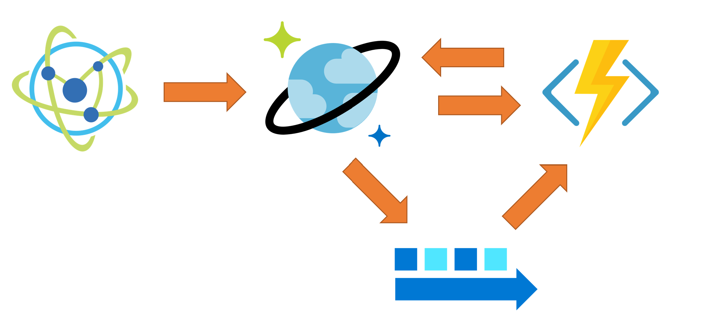

# Near-Real Time Updated Materialized View With Cosmos DB and Azure Functions

This sample shows how materialized view can be kept updated in near-real time using a completely serverless approach with

- Azure Function
- Cosmos DB
- Cosmos DB Change Feed

The high-level architecture is the following one:



Device simulator writes JSON data to Cosmos DB into `raw` collection. Such data is exposed by Cosmos DB Change Feed and consumed by an Azure Function (via Change Feed Processor), that get the JSON document and uses it to create or updated the related materialized views, stored in the `view` collection.

- [Change feed in Azure Cosmos DB](https://docs.microsoft.com/en-us/azure/cosmos-db/change-feed)
- [Change feed processor in Azure Cosmos DB](https://docs.microsoft.com/en-us/azure/cosmos-db/change-feed-processor)

A more detailed discussion on the architecture and solution can be found here:

[Real-Time Materialized Views with Cosmos DB](https://medium.com/@mauridb/real-time-materialized-views-with-cosmos-db-90ecea84f650)

The sample simulates one or more IoT Devices whose generated data needs to be sent, received and processed in near-real time. In this context, "processed" means:

- Provide, for each device, the sum of the sent `value` data and also the last sent value
- Provide one view with all devices and the last data sent by each one

## Sample data

The simulated IoT devices will send this sample data:

    {
        "deviceId": "036",
        "value": 164.91290226807487,
        "timestamp": "2019-03-22T19:46:20.8633068Z"
    }

## Processed data

The resulting processed data for each device will look like the following document:

    {
        "id": "030",
        "aggregationSum": 3519.8782286699293,
        "lastValue": 155.41897977488998,
        "type": "device",
        "deviceId": "030",
        "lastUpdate": "2019-03-22T19:50:17Z"
    }

The document contain aggregated data for the device specified in `id`, as long as the aggregated value in `aggregationSum` and the last sent value in the `lastValue` field.

The `global` materialized view is where the last value *for each device* is stored:

    {
        "id": "global",
        "deviceId": "global",
        "type": "global",
        "deviceSummary": {
            "035": 104.3423159533843,
            "016": 129.1018793494915,
            ...
            "023": 177.62450146378228,
            "033": 178.97744880941576
        },
    }

Values are updated in near-real time by using the Change Feed feature provided by Cosmos DB. The sample is using processing data coming from the Change Feed every second, but it can easily changed to a much lower value if you need more "real time" updates.

- [Trigger Azure Functions from Azure Cosmos DB](https://docs.microsoft.com/en-us/azure/cosmos-db/change-feed-functions)
- [Azure Function Cosmos DB Triggers](https://docs.microsoft.com/en-us/azure/azure-functions/functions-bindings-cosmosdb-v2#trigger---c-attributes)

## Implementation Notes

Data is partitioned by `deviceId` in both the `raw` and `view` collection to make sure order is preserved within data sent by a single device. Collections do not use indexing as only point-lookups are done and since in this sample Cosmos DB is used a key-value store, switching off indexing allows to spare RUs.

## Prerequisites

If you don't have an Azure subscription, create a [free account](https://azure.microsoft.com/free/?ref=microsoft.com&utm_source=microsoft.com&utm_medium=docs&utm_campaign=visualstudio) before you begin.

In addition:

- [Visual Studio 2017](https://visualstudio.microsoft.com/downloads/) or [Visual Studio Code](https://code.visualstudio.com/)
- [.NET Core SDK](https://dotnet.microsoft.com/download)
- [Git](https://www.git-scm.com/downloads)
- [Azure CLI](https://docs.microsoft.com/en-us/cli/azure/install-azure-cli)
- [Azure Storage Explorer](https://azure.microsoft.com/en-us/features/storage-explorer/)

## Getting Started

Make sure you have WSL (Windows System For Linux) installed and have AZ CLI version > 2.0.50. Before running any script also make sure you are authenticated on AZ CLI using

```bash
az login
```

and have selected the Azure Subscription you want to use for the tests:

```bash
az account list --output table
az account set --subscription "<YOUR SUBSCRIPTION NAME>"
```

## Clone the sample project

Clone the repository and open the code-samples directory from your command line tool.

```bash
git clone https://github.com/Azure-Samples/cosmosdb-materialized-views
cd cosmosdb-materialized-views
```

## Create Azure Resources

To create and configure the Azure Resources needed for the project, you just have to run the `deploy.sh` script in the `script` folder.

Script has been tested on Mac OSX and Ubuntu Bash.

    ./script/deploy

The following resources will be created:

- Resource Group
- Azure Storage
- Azure Function (using Consumption Plan)
- Application Insight
- Cosmos DB with 3 Collections (`raw` and `view` with 1000 RU each, `leases` with 400 RU)

By default all deployed resources will have the `mvsample` prefix and the location will be `eastus`. If you don't have any specific naming requirements, by default the generated `ROOT_NAME` will be *uniquified* by postfixing random numbers to make sure you don't have any name collision with someone else trying the sample at the same time.

If needed you can change the following defauly settings

    export ROOT_NAME='mvsample${UNIQUIFIER}'
    export LOCATION='eastus'

in `./script/deploy` to make sure they work for you.

## Run the Producer application

The producer application will generate sample sensor data as described before. The application takes the device ids to generate as parameter:

    cd sensor-data-producer
    dotnet run 1

The above sample will generate random data for device id 001. If you want to generate more data just specify how many sensor you need to be simulated:

    dotnet run 10

will generate data for 10 sensors, from 001 to 010. If you want to generate more workload and you're planning to distribute the work on different clients (using Azure Container Instances or Azure Kubernetes Service for example), you'll find useful the ability to specify which device id range you want to be generated by each running application. For example

    dotnet run 15-25

will generate data with Device Ids starting from 015 up to 025.

### Docker Image

If you want to build and run the simulator using Docker, just run `build.bat` to build the docker image. The run it using

    docker run -it iot-simulator 1-10

to simulate device from 001 to 010, for example.

## Check results

Once the producer is started you can see the result by using Azure Portal or Azure Storage Explorer to look for document create int the `view` collection of the created Cosmos DB database.

You can also take a look at the Application Insight Live Metric Streams to see in real time function processing incoming data from the Change Feed

## Additional Reference

- [Azure Cosmos DB + Functions Cookbook — Connection modes](https://medium.com/microsoftazure/azure-cosmos-db-functions-cookbook-connection-modes-ecf405a750d9)
